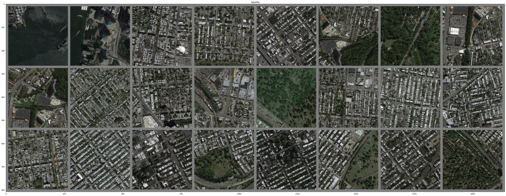

# Satellite Image to Map Translation using Pix2Pix GAN framework
* Dataset: [Download Sat2Map Dataset](https://drive.google.com/file/d/1s5a2UeJR4H_KJ-nV4NmRMkBHr3zn20Tf/view?usp=sharing)

# Introduction
 our project tackles the task of translating satellite imagery into corresponding map representations. Leveraging conditional GANs (cGANs), we ensure that the generated maps not only exhibit realism but also align with the features of the input satellite images. With a U-Net based generator architecture and a custom-designed discriminator, our approach employs both adversarial and L1 loss functions to produce high-fidelity results. Through this innovative application, we bridge the gap between satellite data and actionable map data, offering valuable insights for diverse fields such as urban planning, environmental monitoring, and disaster management
# Generator Architecture - U-Net
* Reference: https://arxiv.org/abs/1505.04597
* Instead of mapping a random noise to an image, the Generator maps an image to another representation of the same image. This is image translation task, and that's why the framework was named "Pix2Pix".
* The neural architecture that the Generator uses is the U-Net, which is basically Encoder-Decoder with skip connections between layers in the Encoder and corresponding layers in the Decoder.
* Architecture of the U-Net:

* The architecture above is the U-Net 572. What I used in this project is U-Net 256. The only difference is the input image size and the output image size.
* Function: 
  - The Encoder is the convolutional layers to the left of the network. The role of those layers is to extract core features of the image and map those features to the bottlekneck latent space at the middle of the network (an 1024-D array). This latent space is the encoded form which contains the most important information of the input image.
  - The Decoder is the transpose convolutional layers to the right of the network. Those layers map encoded latent space of the image back to a full-size image. Those layers do not simply output the same input image, but they are trained to map the encoded features to an image with another representation. For instance, the Encoder encodes the information of a Dog photo, and then the Decoder maps the encoded information of the dog to a drawing of the same dog. Both input and output have the same information: a dog, but they have different representation: a photo and a drawing. 
  - To make training more stable, extracted information from the Encoder network was concantenated to corresponding layers in the Decoder network. This ensures that the Decoder has sufficient information to map the latent space to a realistic image.
  - Since the Encoder and Decoder was in the same network, we can train U-Net end-to-end.

# Discriminator Architecture - Convolutional Neural Network
* In Pix2Pix and in cGAN, Discriminator is still a binary Convolutional Neural Network.
* The difference between Discriminator in Pix2Pix with that in the original GAN is that the Discriminator in Pix2Pix not only takes the examined image **y** but also the conditional image **x** as the inputs. In other words, **x** was concatenated to **y** as an input before feeding into the network, and the input now have 6 channels (3 for the examined image and 3 for the conditional image) instead of 3 channels.

# Loss Function
* Now we define the Objective for the training process.
* In Image translation task, the GAN training scheme is almost the same as the original GAN, except now we have conditional input and an additional L1 loss to ensure the generated image is not too different from the expected output.
* **GAN Loss**:

Just like original GAN, optimizing this Loss will forces the Generator to produce results with overall distribution close to that of the image representation in the dataset and thus improve the structural quality of the Generator's output.
* **L1 Loss**:

By using pixel-wise loss between 2 images, this loss forces the output image to be as close to the expected output as possible. In other words, it improves the minor details of the output.
* **Final Loss**:

We simply combine GAN loss and L1 Loss to have the final Loss for the entire algorithm.

# Results
* The image patch with 24 samples below shows the results of the Sat2Map Generator.
* Satellite imagery (input):

* Map Representation (output):

