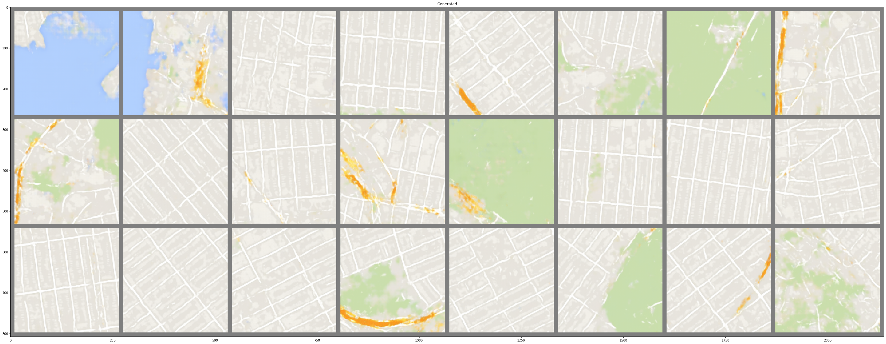

Naan muthalvan Generative AI project -
                        V G Harish Prasath -
                        715521104013
# Satellite Image to Map Translation using Pix2Pix GAN framework
* Dataset: [Download Sat2Map Dataset](https://drive.google.com/file/d/1s5a2UeJR4H_KJ-nV4NmRMkBHr3zn20Tf/view?usp=sharing)

# Introduction
 our project tackles the task of translating satellite imagery into corresponding map representations. Leveraging conditional GANs (cGANs), we ensure that the generated maps not only exhibit realism but also align with the features of the input satellite images. With a U-Net based generator architecture and a custom-designed discriminator, our approach employs both adversarial and L1 loss functions to produce high-fidelity results. Through this innovative application, we bridge the gap between satellite data and actionable map data, offering valuable insights for diverse fields such as urban planning, environmental monitoring, and disaster management

# Solution and Approach
Our solution harnesses the power of conditional Generative Adversarial Networks (cGANs) within the Pix2Pix framework to seamlessly translate satellite images into corresponding map representations. Implementing a U-Net architecture for the generator and a tailored convolutional neural network for the discriminator, we ensure both realism and fidelity in our output. By integrating adversarial and L1 loss functions, our approach not only captures overall distribution but also preserves fine-grained details, culminating in accurate and visually compelling results. Through this meticulously crafted strategy, we facilitate effective satellite image interpretation for diverse applications, from urban planning to environmental analysis

# Generator:
Our U-Net-based generator extracts core features from satellite images and maps them to corresponding high-resolution map representations, ensuring both realism and fidelity in the output.

# Discriminator:
Employing a custom convolutional neural network architecture, our discriminator efficiently distinguishes between real and generated map images by considering both the generated output and the corresponding satellite input, enhancing the overall adversarial training process.

# Results
* The image patch with 24 samples below shows the results of the Sat2Map Generator.
* Satellite imagery (input):

* Map Representation (output):

